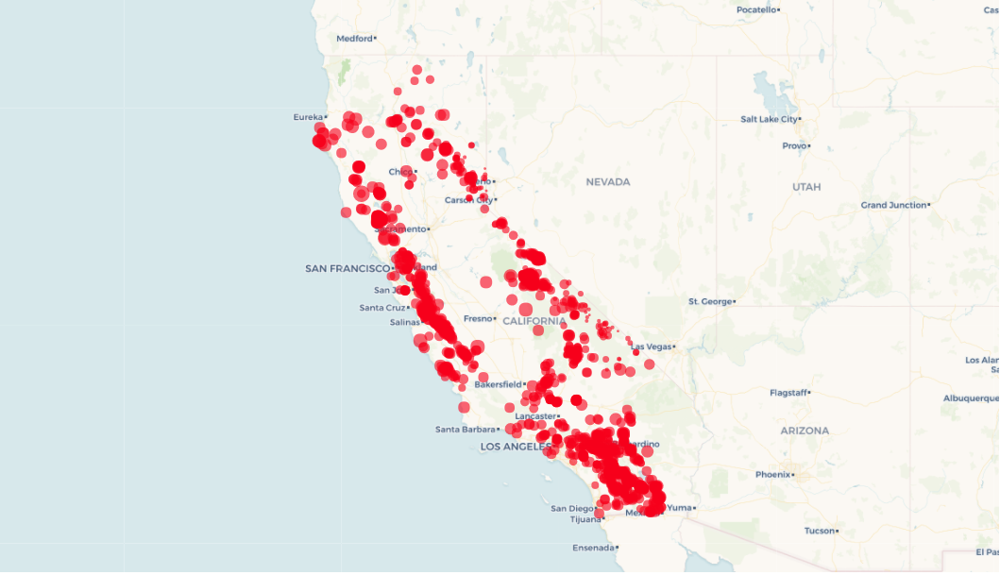

# 12-geospatial-viz-with-d3-part2
Part 2 of using D3 to visualize geospatial data. 

## Introduction
Last class, `11-geospatial-viz-with-d3`, introduced geospatial data and **Geographic Information Systems**, which refers to both a field of expertise (technically called [**Geospatial Information Science**](http://gisgeography.com/giscience-geographic-information-science/)) as well as software that enables storing, visualizing, transforming, and analyzing geospatial data. The free and open source GIS software QGIS was used to visually inspect geospatial data. We made a [**Choropleth Map**](http://www.axismaps.com/guide/univariate/choropleth/) of county level drug overdose deaths with D3 and **TopoJSON**, displayed in the **U.S. Albers map projection**. 

## Part 2
In this class we'll learn how to implement an interactive **Slippy Map** of earthquakes in California using D3 and **Raster Map Tiles**. The term **Slippy Map** is what cartographers coined interactive maps on the web that allow a user to zoom and pan the map without requiring refreshing the page. It is still commonly used by cartographers, GIS specialists, and data viz practitioners today.

**Map Tiles** are the defacto format which web mapping services such as Google Maps, Apple Maps, Bing Maps, and OpenStreetMap use to present the cartographic rendering of geospatial data for displaying _basemaps_ on their platforms. **Map tiles** are typically 256 by 256 pixel square images that align in a grid like fashion to fill an area of a webpage. At the outer most zoom level, zoom level zero, the entire world can be rendered in a single map tile. Each zoom level doubles in both the x and y dimensions, so a single tile is replaced by 4 tiles when zooming in by a factor of one. Thus at zoom level one, there will now be four map tiles, at zoom level two there will be 16 map tiles, and so on. About 22 zoom levels are sufficient for most practical purposes. The **Web Mercator** map projection is used, limiting the map area around 85 degrees latitude and distorting the map area more and more towards to poles. Besides navigation, map tiles are useful for giving context to geospatial data; features such as points of interest, geographic boundaries, or in our case [real time earthquake data provided by the USGS](https://earthquake.usgs.gov/fdsnws/event/1/). 

Rendering arbitrary geospatial data on top of a basemap while also enabling a user to zoom and pan is a common requirement of many geospatial data visualizations. We will implement this using the [`d3-tile`](#) library, but there are more popular Javascript libraries such as [Leaflet.JS](#) that have many helpful built in features that make it easier to provide a rich user experience for web mapping. 

## Instructions
In the [`data`](`./data/`) directory of this repo you will find two zip'd **Shapefiles**. Remember from last class that a single Shapefile consists of at least 4 separate files ending in the file extensions `.shp`, `.shx`, `.prj`, and `.dbf`. _**You will need, at a bare minimum, these four files in order to work with data in Shapefile format. They need to have the same file name and to be located in the same directory.**_

- `earthquakes.shp` earthquake locations in the U.S. from October, 2017. This data is stored in U.S. Albers.

- `ne_10m_admin_1_states_provinces.shp`: states and provinces of nations for the world at 1:10 million resolution. This data is stored in WGS84 (lat, lon).

To work with these two Shapefiles we will need to **reproject** one of them so that they both use the same **Coordinate Reference System.** We'll choose WGS84/ESPG:4326, as that's the CRS most typically required by web mapping libraries.

We will use the world states and provinces boundary data to extract earthquake locations within California only, using QGIS, so that we can create the map pictured above. 

## Resources
- [d3-tile](https://github.com/d3/d3-tile)
- [d3-zoom](https://github.com/d3/d3-zoom)
- [d3-geo](https://github.com/d3/d3-geo)
- [various open map tiles](http://leaflet-extras.github.io/leaflet-providers/preview/)